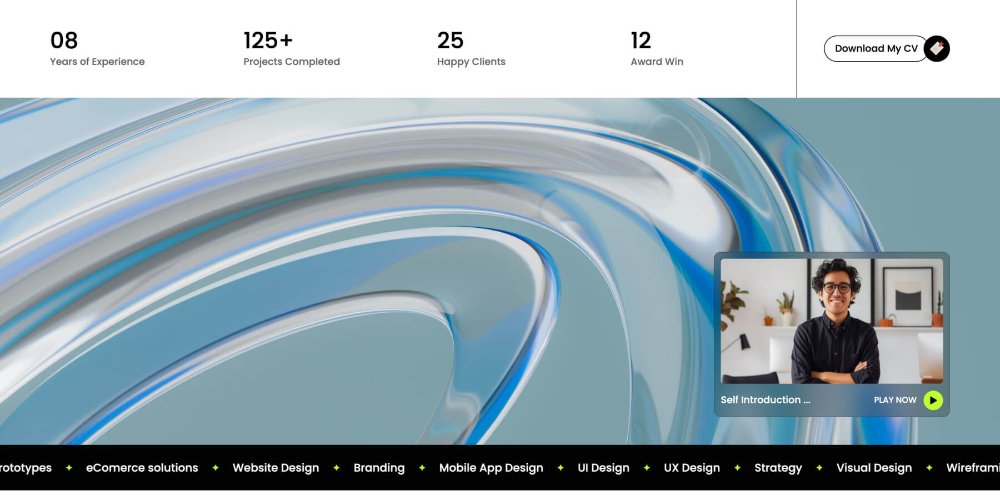

### Project overview

Sit vulputate aliquam cras aliquam Et, nibh congue consequat pellentesque Metus fermentum dui pellentesque morbi volutpat commodo viverra. Feugiat nulla non mattis mi Bibendum diam tempus ultrices ultricies viverra Feugiat placerat viverra tortor orci feugiat. Scelerisque dictum consequat egestas enim, at orci. Eu a posuere aliquam sed aliquam tortor non Morbi id massa interdum nam tellus Magna nunc interdum tellus neque auctor sagittis.

Cursus felis elit pulvinar aliquam ut laoreet nunc mattis sagittis urna tristique diam at morbi vel eget arcu magna sit justo ornare a ante. Eget turpis vitae ultrices quis eu adipiscing tincidunt sollicitudin neque maecenas iaculis pellentesque libero pharetra nisl tellus sodales egestas blandit. Ornare maecenas leo congue nibh arcu eros a lorem leo at proin senectus sit lacus semper nunc vitae nec aenean elementum ipsum vulputate.

### What we did

- Sit vulputate aliquam cras aliquam. Et, nibh congue consequat pellentesque.
- Vestibulum massa aliquet odio mauris duis amet. In sed dapibus porta est amet.
- Urna augue arcu duis eget proin sed morbi. Purus sit nunc sodales aliquam.
- Tortor tellus commodo volutpat sed vel enim. Mi justo, proin volutpat turpis a et.
- Ac ultrices sed odio fames dolor in eu. Augue tellus ac gravida nunc, ultrices lectus.
- Sit vestibulum nullam neque nullam. Turpis integer viverra ornare commodo pellentesque est.
